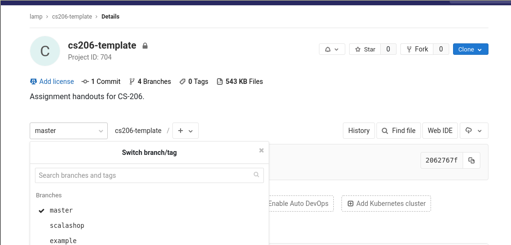

# CS-206 Assignments

This repository contains the assignments of *Parallelism & Concurrency* course.

### Each assignment is completed in a specific branch

For each assignment, the code given can be found in `<branch_name>` and my implementation of the solution in `my-<branch_name>`.

Useful links:

  * [Courseware](https://courseware.epfl.ch/courses/course-v1:EPFL+CS-206+2019_T1/course/)
  * [Moodle forum](https://moodle.epfl.ch/enrol/index.php?id=14388)
  * [How to setup the development environment](https://lampepfl-courses.github.io/moocs/tools-setup/Tools%20Setup.html)
  * [How to submit assignments](https://lampepfl-courses.github.io/moocs/submission/submission.html)

## To select a branch, click on "master" (below the project description)

